# Vue3-Vuex-TypeScript 踩坑之旅（一）

## 前言

vue3 已经来了，vuex 新版本也在 beta 中，在应用于项目前，先过过水，气的我差点把电脑砸了，为啥要砸，咱们开始正文吧...

## 安装

```
npm init vite-app vue3-vuex-ts
npm install
```

## 开始正文

1.将 js 文件改造成 ts 文件

- main.js -> main.ts
- 修改 vue 文件中的 script 类型为 lang = "ts"
- 修改 index.html

```html
<script type="module" src="/src/main.ts"></script>
```

2.创建 vue 的文件声明

- ts 环境中没有 vue 模块声明
- 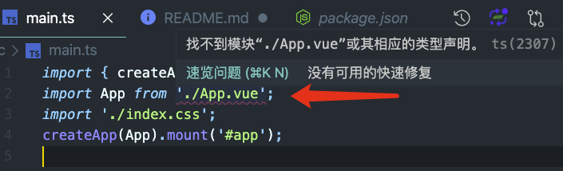
- src 下创建 vue.d.ts 文件

```js
declare module '*.vue' {
  import { FunctionalComponent, defineComponent } from 'vue';
  const component: ReturnType<typeof defineComponent> | FunctionalComponent;
  export default component;
}
```

## 接入 vuex

```
npm install vuex@next --save
```

### installing，let's talk about of vuex

#### 为什么 vuex2 能进行双向绑定？

```js
let Vue;

class Store {
  constructor(options) {
    const { getters, state, mutations, actions } = options;
    this._mutations = mutations;
    this._actions = actions;
    if (getters) {
      this.handleGetters(getters);
    }
    this._vm = new Vue({
      data: {
        $$state: state,
      },
    });
    this.commit = this.commit.bind(this);
    this.dispatch = this.dispatch.bind(this);
  }

  get state() {
    return this._vm.data.$$state;
  }

  commit(type, payload) {
    const entry = this._mutations[type];
    if (entry) {
      entry(this.state, payload);
    }
  }

  dispatch(type, payload) {
    const entry = this._actions[type];
    if (entry) {
      entry(this, payload);
    }
  }

  handleGetters(getters) {
    this.getters = {};
    Object.keys(getters).forEach(key => {
      Object.defineProperty(this.getters, key, {
        get: () => getters[key](this.state),
      });
    });
  }
}

function install(_Vue) {
  Vue = _Vue;
  Vue.mixin({
    beforeCreate() {
      if (this.$options.store) {
        Vue.prototype.$store = this.$options.store;
      }
    },
  });
}

export default {
  Store,
  install,
};
```

- vuex 强绑定了 Vue(将观测数据 new vue)，因此 vux 无法作为状态工具被别的状态使用
- 通过 Vue.mixin 的 beforeCreate 将 \$store 挂在到 Vue 的原型链上
  不吹不喷哈：Vue 不能回收，所有状态无法回收，所有 Vue 插件无法回收
  每一次使用组件都走一遍原型链，在 vue 渲染过程中，beforeCreate 会被执行无数遍 😓

#### vuex3

- 利用 reactive、provide 来进行双向绑定，这里就不细说了，指出几个关键点

```js
store._state = reactive({
  data: state
})

install (app, injectKey) {
  app.provide(injectKey || storeKey, this)
  app.config.globalProperties.$store = this
}
```

### 准备蹲坑吧

1.main.ts

```js
import { createApp } from 'vue';
import App from './App.vue';
import store from './store';
import './index.css';

createApp(App).use(store).mount('#app');
```

2.创建 store 的相关东西

- index.ts

```js
import { createStore } from 'vuex';
import modules from './modules';

import { userState } from './modules/user';
import { detailState } from './modules/detail';

export interface State {
  user: userState;
  detail: detailState;
}

export default createStore <
  State >
  {
    modules,
  };
```

- modules.ts

```js
import user from './modules/user';
import detail from './modules/detail';

export default {
  user,
  detail,
};
```

- modules/user.ts

```js
export type userState = {
  isLogin: boolean,
};

const state: userState = {
  isLogin: true,
};

export default {
  namespaced: true,
  state,
  getters: {
    loginInfo: (state: userState): string => {
      return `${state.isLogin ? '已登陆' : '未登陆'}`;
    },
  },
  mutations: {
    setUserInfo(state: userState, payload: boolean): void {
      console.log('数据请求', payload);
      state.isLogin = payload;
    },
  },
  actions: {
    changeUserInfo({ commit }, payload: { data: boolean }): void {
      console.log('action执行成功');
      setTimeout(function () {
        commit('setUserInfo', false);
      }, 2000);
    },
  },
};
```

- detail.ts 此处省略

- HelloWorld.vue

```vue
<template>
  <div>
    <h1>{{ msg }}</h1>
    <button @click="count++">count is: {{ count }}</button>
    <div>{{ info1 }}</div>
    <div>{{ info2 }}</div>
    <button @click="logout">退出</button>
  </div>
</template>

<script lang="ts">
import { useStore } from 'vuex';
import { defineComponent, computed } from 'vue';
import { State } from '../store';

export default defineComponent({
  name: 'HelloWorld',
  props: {
    msg: String,
  },
  data() {
    return {
      count: 0,
    };
  },
  setup(props) {
    const { state, getters, dispatch, commit } = useStore<State>();
    console.log('🍊', state.user.isLogin); // 🍊 true
    console.log('🍎', state.detail.title); // 🍎 hello
    console.log('🚀', getters['user/loginInfo']); // 🚀 已登陆

    const info1 = computed(() => getters['user/loginInfo']);
    const info2 = computed(() => getters['detail/detailInfo']);

    const logout = () => commit('user/setUserInfo', false); // 数据请求 false
    // dispatch()
    return { info1, info2, logout };
  },
});
</script>
```

**到了结束的时候了，感觉自己萌萌哒 🐶**

No.No.No，如果团队项目这么做，估计脑瓜子得被销放屁了...🤯

## 这样真的结束了么？

- 来，看图说话
  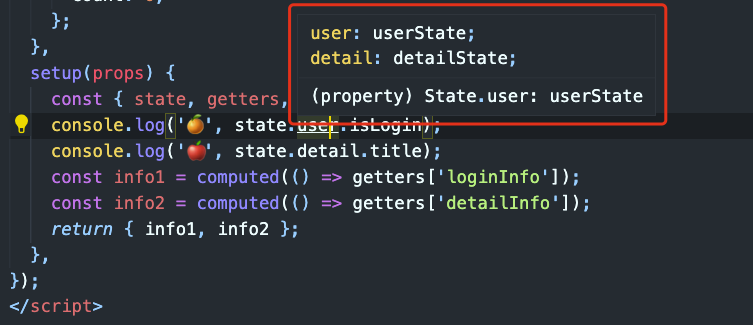
  哦哦，State 我包了一层，提示粗糙

  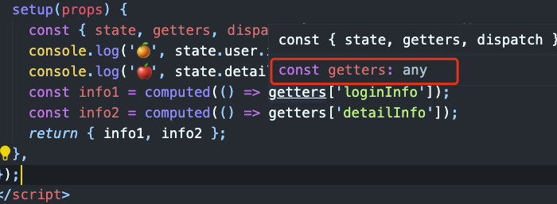
  阿西巴，这什么鬼，any，此时内心已经崩溃，无力吐槽...

  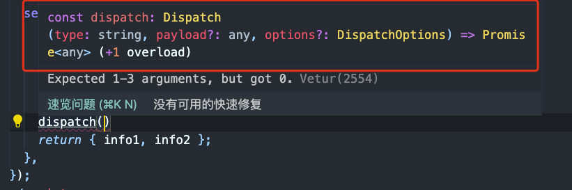
  dispath 提示让传 string 类型的 type，我特么哪知道要传啥（commit 也这德行），那我还不如直接用 js 写方便呢

  前期做了如此多的铺垫，结果提示让传 string 类型的 type，我特么上哪知道要传啥，交给 ts 的活儿，反过来让我自己弄，之前的全白费？

  这就好比，去夜店泡吧，前戏铺垫的挺足，结果出去后发现是个人妖～ 😓

  **该搞还是得搞，那么现在开始进入正题**

### 开始爬坑

#### 噩梦的开始

1.修复 State 问题，modules/user.ts

```js
const state = {
  isLogin: true,
};

export type userState = typeof state;

export default {
  // ....
};
```

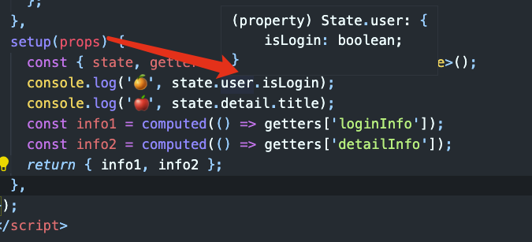

但这样也不行，我不能每个组件都引一次 State 吧，咱们直接到下一步

2.修复 getters 问题～

- vue 和 react 一样通过 hooks 处理状态，那么咱也整个 hooks，把 useStore 封装起来，在里面修复问题
- 需要提供 gettters 中 如'loginInfo' 的注释，dispatch、 commit 的注释
- - 遍历 modules，找到所有 getters、actions、mutations，并获取它们的 type
- - 将它们通过 hooks 传递出去

- 修改 HelloWorld.vue

```vue
<script lang="ts">
// import { useStore } from 'vuex';
import { defineComponent, computed } from 'vue';
// import { State } from '../store';
import { useStoreHooks } from '../hooks';

export default defineComponent({
  name: 'HelloWorld',
  props: {
    msg: String,
  },
  data() {
    return {
      count: 0,
    };
  },
  setup(props) {
    // const { state, getters, dispatch, commit } = useStore<State>();
    const { state, getters, dispatch, commit } = useStoreHooks();
    console.log('🍊', state.user.isLogin); // 🍊 true
    console.log('🍎', state.detail.title); // 🍎 hello
    console.log('🚀', getters['user/loginInfo']); // 🚀 已登陆

    const info1 = computed(() => getters['user/loginInfo']);
    const info2 = computed(() => getters['detail/detailInfo']);

    const logout = () => commit('user/setUserInfo', false); // 数据请求 false
    // dispatch()
    return { info1, info2, logout };
  },
});
</script>
```

- 创建 hooks/index.ts

```js
import { useStore } from 'vuex';
import { State } from '../store';
// 这几个玩意的type
import { Getters, Dispatch, Commit } from './utils';

interface UseStoreHooks {
  state: State;
  getters: Getters;
  commit: Commit;
  dispatch: Dispatch;
}

const useStoreHooks = (): UseStoreHooks => {
  const store = useStore<State>();
  console.log(store);
  // return store;
  // 自定义的进行输出结果
  const { state, getters, dispatch, commit }: UseStoreHooks = store;
  return {
    state,
    getters,
    commit,
    dispatch,
  };
};

export { useStoreHooks };
export default useStoreHooks;
```

- hooks/utils.ts
- - 写 type，这玩意可不是 js，每一段都需要从下往上看
- - 安装最新 typescript，yarn add typescript@next（目前）
- - vscode 切换 typescrit 版本
    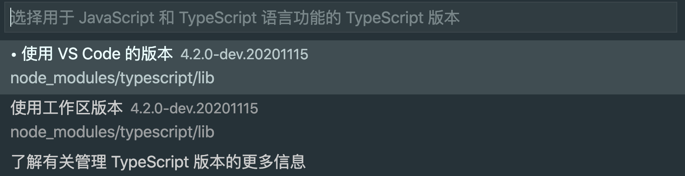

```js
/* 拿到store的modules */
import modules from '../store/modules';

/* 获取到 getters 结构类型 */
// 匹配到 单个module 下的 getter，小技巧 infer 为某一项
type GetGetter<GetterType> = GetterType extends { getters: infer G } ? G : unknown;
// 获取 vuex 所有的 getters 模块
type GetGetters<GetterTypes> = {
  [K in keyof GetterTypes]: GetGetter<GetterTypes[K]>;
};
type ModuleGetters = GetGetters<typeof modules>;

// --------------------

/* 获取到 mutations 结构类型 */
// 配到 单个 module 下的 mutations
type GetMutation<MutationType> = MutationType extends { mutations: infer M } ? M : unknown;
// 获取 vuex 所有的 mutations 模块
type GetMutations<MutationTypes> = {
  [K in keyof MutationTypes]: GetMutation<MutationTypes[K]>;
};
type ModuleMutations = GetMutations<typeof modules>;

// --------------------

/* 获取到 actions 结构类型 */
// 配到 单个 module 下的 action
type GetAction<ActionType> = ActionType extends { actions: infer A } ? A : unknown;
// 获取 vuex 所有的 actions 模块
type GetActions<ActionTypes> = {
  [K in keyof ActionTypes]: GetAction<ActionTypes[K]>;
};
type ModuleActions = GetActions<typeof modules>;

// --------------------

/* Getter/Commit/Dispatch 智能提示处理 */
// gettters[模块名/方法]、commit[模块名/方法]、dispatch[模块名/方法]
// ts4.1 以上支持 模板字符串语法，需要安装最新的 yarn typescript（目前yarn add typescript@next）
// 传入的是 keyof 有可能是symbol | number,所以 P & string 取其中的string
type AddPrefix<P, K> = `${P & string}/${K & string}`;

// 调换一下顺序：user: "user/loginInfo" => "user/loginInfo": user
type GetSpliceKey<Module, Key> = AddPrefix<Key, keyof Module>
/**
 * { 'user/loginInfo': () => {} }
 */
// type GetSpliceKeys<Modules> = {
//   [K in keyof Modules]: GetSpliceKey<Modules[K], K>
// }
// type xx = GetSpliceKeys<ModuleGetters>

type GetSpliceKeys<Modules> = {
  [K in keyof Modules]: GetSpliceKey<Modules[K], K>
}[keyof Modules]
// type xx = GetSpliceKeys<ModuleGetters>

type GetFunc<T, A, B> = T[A & keyof T][B & keyof T[A & keyof T]];
type GetSpliceObj<T> = {
  // K extends `${infer A}/${infer B}`   相当于  user/loginInfo  A=>user B=>loginInfo
  [K in GetSpliceKeys<T>]:K extends `${infer A}/${infer B}` ? GetFunc<T, A, B> : unknown
}

// --------------------

/* Getters/Mutations/Actons 拼接好 xxx/xxx 的格式  */
type GenGetters = GetSpliceObj<ModuleGetters>;
type Getters = {
  [K in keyof GenGetters]:ReturnType<GenGetters[K]>
}

// --------------------

type GenMutations = GetSpliceObj<ModuleMutations>;
type Mutations = {
  [K in keyof GenMutations]:ReturnType<GenMutations[K]>
}

// --------------------

type GenActions = GetSpliceObj<ModuleActions>;
type Actions = {
  [K in keyof GenActions]:ReturnType<GenActions[K]>
}

// --------------------

// commit 获取 payload 参数类型
type MutationsPayload = {
  // Parameters 获取函数参数
  [K in keyof GenMutations]:Parameters<GenMutations[K]>[1]
}

interface GetCommit<T> {
  // 可选参数类型，会自动加上undefined
  <K extends keyof T>(mutation: K, payload?: T[K]): void;
}

type Commit = GetCommit<MutationsPayload>;

// --------------------

// dispatch 获取 payload 参数类型
type ActionPayload = {
  // Parameters 获取函数参数
  [K in keyof GenActions]:Parameters<GenActions[K]>[1]
}
interface GetDispatch<T> {
  // 可选参数类型，会自动加上undefined
  <K extends keyof T>(action: K, payload?: T[K]): Promise<unknown>;
}

type Dispatch = GetDispatch<ActionPayload>;

// --------------------

export {
  Getters, Mutations, Actions, Dispatch, Commit
};
```

- 来看一下结果
  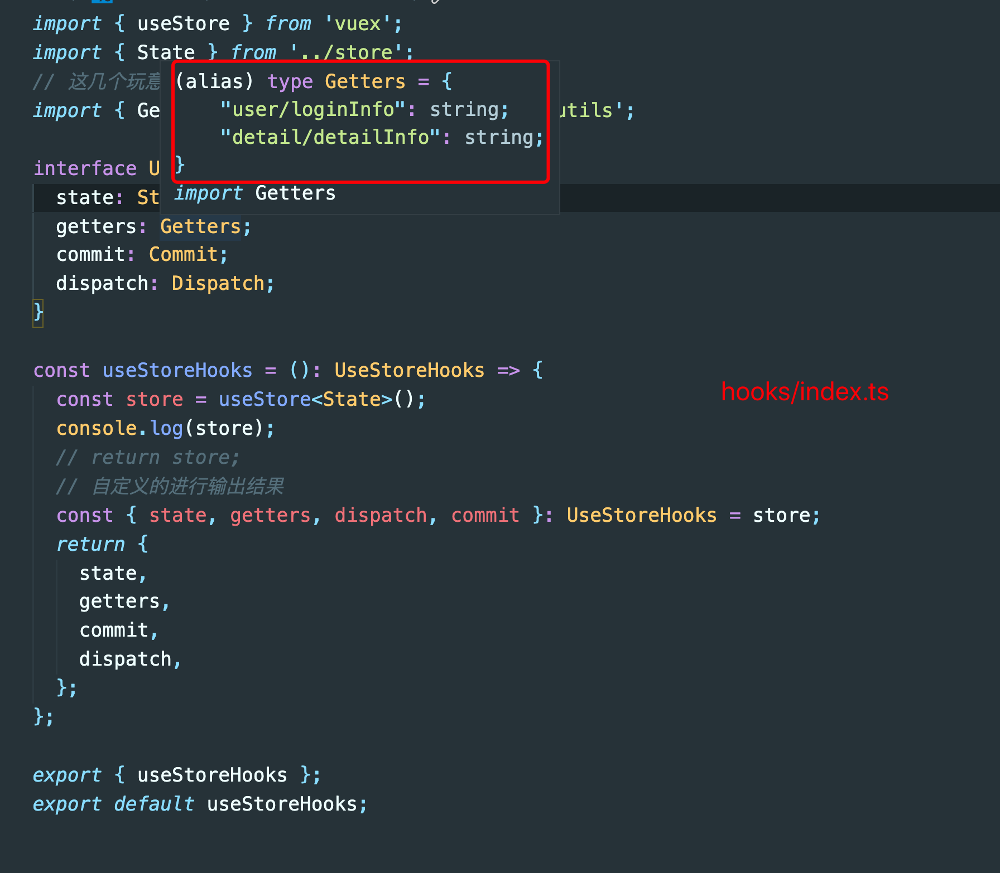
- hooks，里面已经拿到 type 了

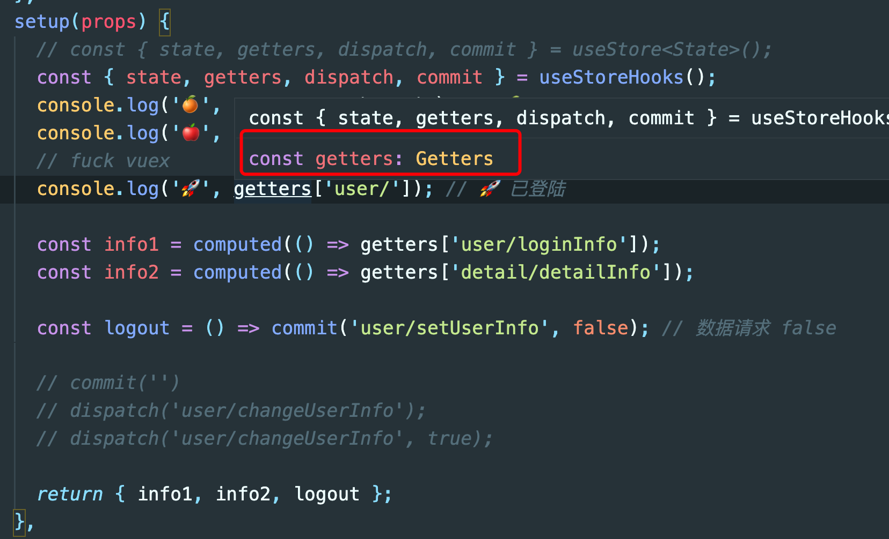

- 我特么心态崩了，我在 hooks 里面明明可以拿到 getters，在外面又拿不到了 ～～～～～

#### 如梦初醒，仿如隔世

- ts 中可以取到，vue 拿不到，呵呵~
- 好吧，把 script 部分拿出来，总可以了吧，耐心已经耗尽...

  1.把 HelloWorld.vue 中的 ts 部分全部放到 HelloWorld.ts

  2.HelloWorld.vue

```vue
<template>
  <div>
    <h1>{{ msg }}</h1>
    <button @click="count++">count is: {{ count }}</button>
    <div>{{ info1 }}</div>
    <div>{{ info2 }}</div>
    <button @click="logout">退出</button>
  </div>
</template>

<script lang="ts" src="./HelloWorld.ts"></script>
```

- 去 HelloWorld.ts 去验证一下，特么终于成功了
- - getters
    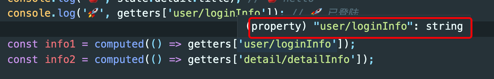
    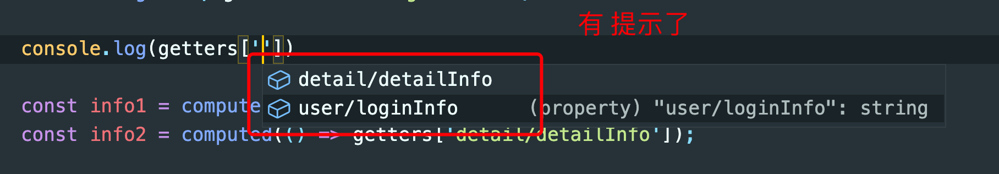
- - commit
    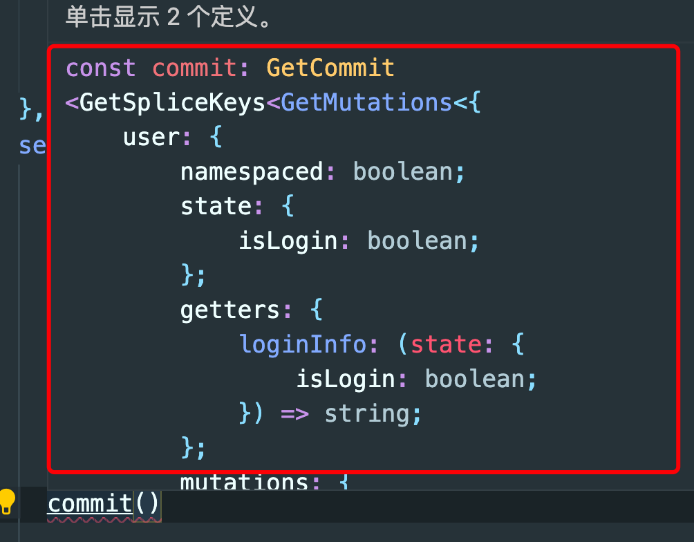
    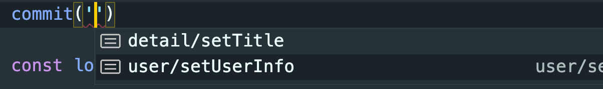
    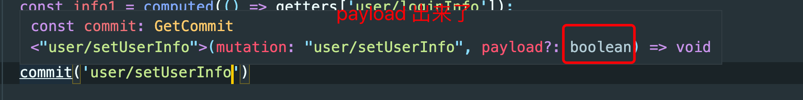
    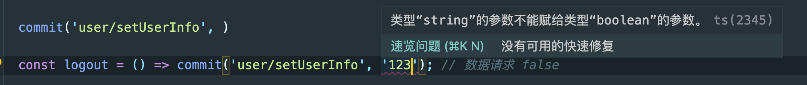
- - dispatch
    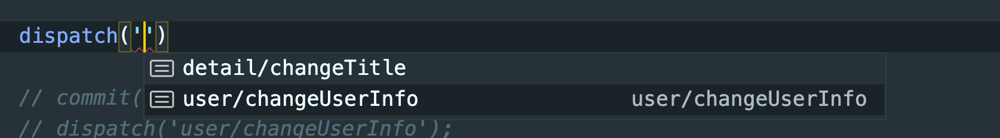
    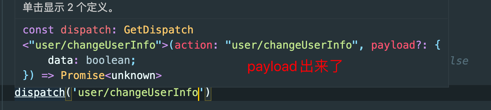
    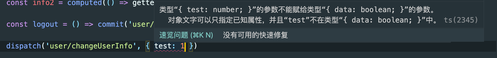

## 尾声

抬眼看窗外，天已亮了，烟已抽完。
一夜过后、腰膝酸软、仿佛身体被掏空...

**真心学不动了：手拿打火机，哪里不会点哪里，妈妈再也不用担心我的学习了...**
